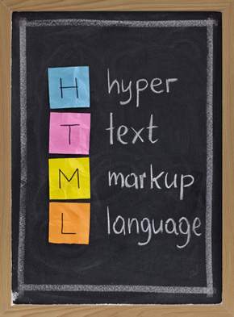
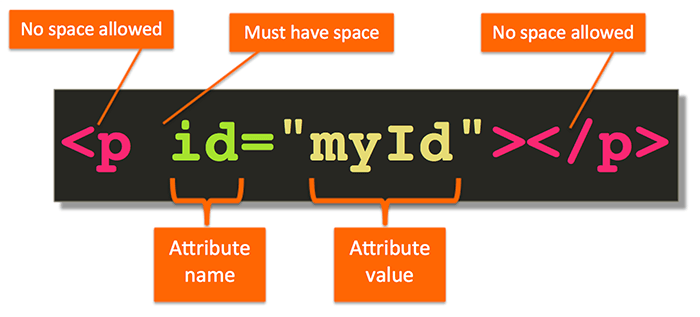
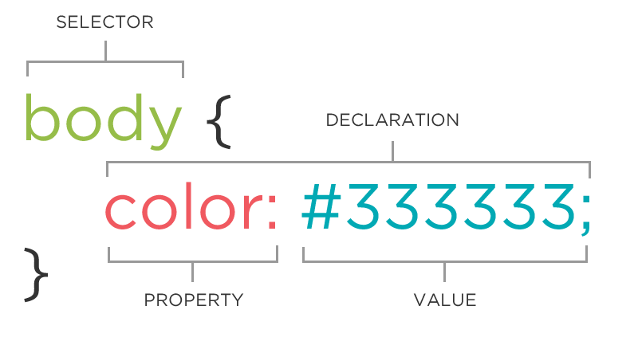
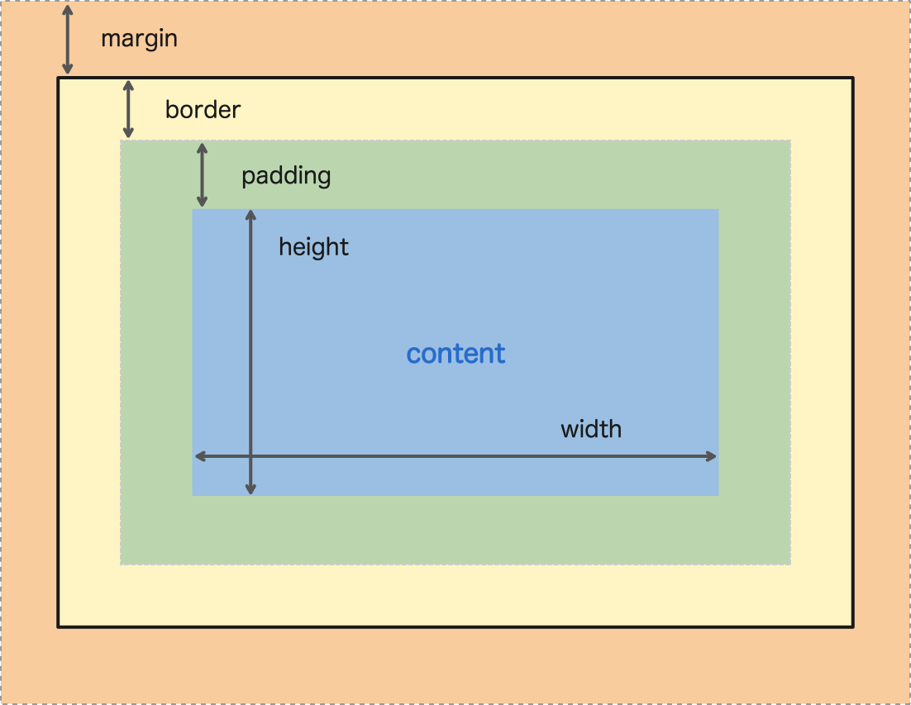

# Aula 01

## Fundamentos WEB

## Ambiente

### VSCode
* Extensões utilizadas
  * Live Server
  * Material Icon Theme
  * Omni Theme
  * Prettier
* settings.json

``` 
{
    "editor.fontSize": 16,
    "terminal.integrated.fontSize": 16,
    "workbench.colorTheme": "Omni",
    "workbench.iconTheme": "material-icon-theme",
    "editor.bracketPairColorization.enabled": true,
    "editor.minimap.enabled": false,
    "editor.wordWrap": "on",
    "workbench.editor.tabSizing": "shrink",
    "explorer.compactFolders": false,
    "files.autoSave": "afterDelay",
  
    // formatter
    "prettier.tabWidth": 2,
    "prettier.semi": false,
    "prettier.singleQuote": true,
    "prettier.trailingComma": "none",
    "prettier.arrowParens": "avoid",
    "prettier.endOfLine": "auto",
    "editor.tabSize": 2,
    "editor.formatOnSave": true,
    "[javascript]": {
      "editor.defaultFormatter": "esbenp.prettier-vscode"
    },
    "[html]": {
      "editor.defaultFormatter": "esbenp.prettier-vscode"
    },
    "[css]": {
      "editor.defaultFormatter": "esbenp.prettier-vscode"
    },
    "liveServer.settings.donotShowInfoMsg": true,
    "liveServer.settings.donotVerifyTags": true,
  }"
  ```

## Tecnologia

### HTML
* O que é?



* Tag e Anatomia




### CSS

* Seletores e Anatomia



* Box Model

# Treinamentos-RocketSeat-NlwReturn
